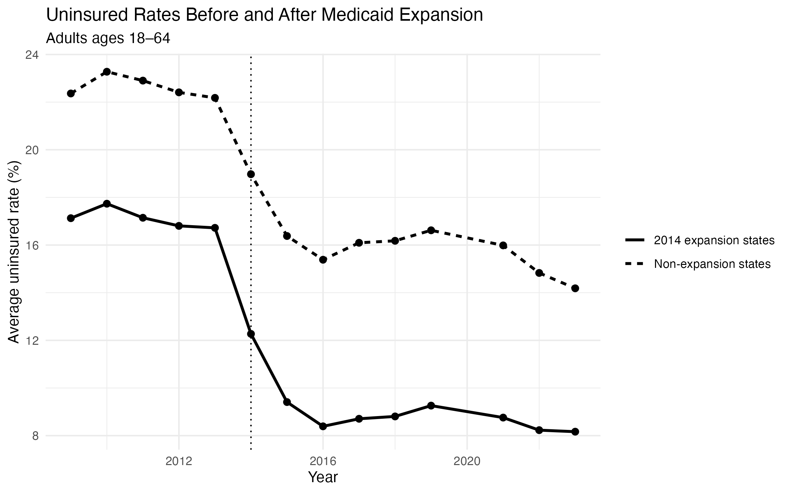
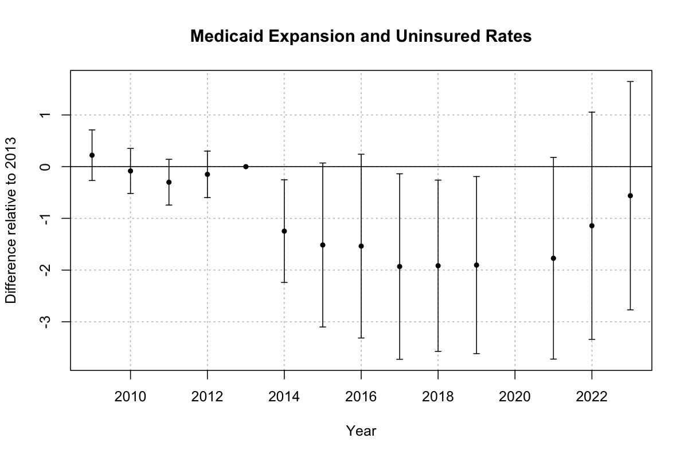

# Medicaid Expansion and Health Insurance Coverage

This independent research project examines whether the 2014 ACA Medicaid expansion was associated with changes in health insurance coverage among U.S. adults ages 18–64.

I use annual American Community Survey (ACS) data to construct a state-year panel from 2009–2023 and compare states that implemented Medicaid expansion in 2014 with states that had not expanded by the end of the sample period.

## Research Question

How did Medicaid expansion affect uninsured rates among adults ages 18–64?

## Data

**Source:** U.S. Census Bureau, American Community Survey (ACS)

- Annual ACS 1-year estimates
- 50 states and Washington, D.C.
- 2009–2023
- 2020 excluded because standard ACS 1-year estimates were not released
- Main outcome: uninsured rate among adults ages 18–64

The uninsured rate is constructed from detailed ACS health insurance variables in table B27001.

## Methods

- Difference-in-differences
- State fixed effects
- Year fixed effects
- Standard errors clustered by state
- Event-study analysis
- Joint pre-trends testing
- Robustness analysis excluding Wisconsin

The main analysis compares 27 states that implemented Medicaid expansion in 2014 with 10 states that had not expanded by the end of the sample period.

## Main Results

The baseline difference-in-differences estimate suggests that Medicaid expansion was associated with a **1.44 percentage-point relative reduction in the uninsured rate** among adults ages 18–64.

The event-study estimates show little evidence of differential trends before expansion in the baseline specification. A joint test of the 2009–2012 pre-treatment coefficients gives **p = 0.252**.

As a robustness check, I exclude Wisconsin because its Medicaid policy differed from other non-expansion states. The estimated effect remains similar at **-1.28 percentage points**, although the joint pre-trends test becomes statistically significant (**p = 0.026**). This sensitivity means the results should be interpreted cautiously.

## Figures

### Uninsured Rate Trends



### Event Study



## Project Structure

```text
01_build_data.R
02_medicaid_expansion.R

data/
    processed/
        insurance_panel.csv

figures/
    uninsured_trends.png
    event_study.png

tables/
    descriptive_statistics.csv
    did_results.csv
    pretrend_tests.csv
